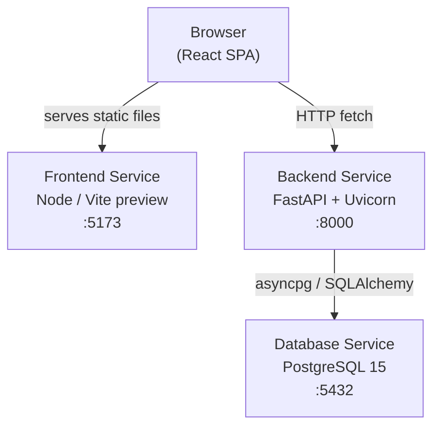
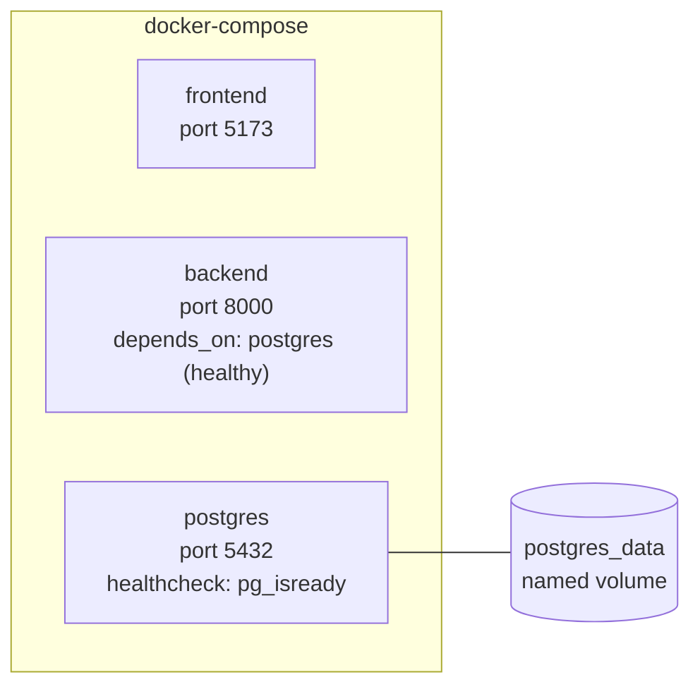
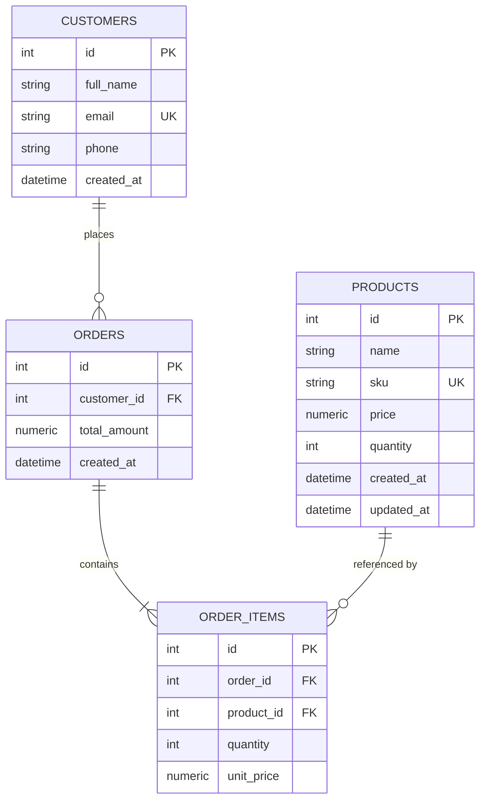

# Design Document — Inventory & Order Management System

## Overview

The Inventory & Order Management System is a full-stack web application that lets business operators manage their product catalog, customer records, and sales orders through a browser-based interface. The system is composed of three independently containerized services:

- **Backend**: A FastAPI application (async, Python 3.11+) that exposes a RESTful JSON API. Business logic lives in service modules; SQLAlchemy 2.0 (async) handles all database interaction.
- **Frontend**: A React 19 single-page application (Vite) that communicates with the backend exclusively via `fetch` calls to the REST API.
- **Database**: PostgreSQL 15 that persists all application data. The backend connects via an async `asyncpg` driver through SQLAlchemy.

All three services are orchestrated by Docker Compose and start with a single `docker compose up` command.

### Key Design Decisions

| Decision | Choice | Rationale |
|---|---|---|
| Async ORM | SQLAlchemy 2.0 async | Matches `asyncpg` driver; non-blocking I/O under Uvicorn |
| Validation | Pydantic v2 schemas | Native FastAPI integration; strict field-level error messages |
| Order atomicity | Single DB transaction per order creation | Prevents partial stock deductions on failure |
| Price snapshot | `unit_price` column on `order_items` | Historical order totals are immutable after creation |
| Frontend routing | React state-based page switching | No router library installed; avoids adding a dependency |
| Error propagation | API returns structured `{"detail": "..."}` JSON | Frontend can always read `.detail` from error responses |

---

## Architecture



### Request Flow

1. The user's browser loads the React SPA from the Vite service on port 5173.
2. All data operations are made directly from the browser to the FastAPI service on port 8000 (CORS is enabled on the backend for `http://localhost:5173`).
3. FastAPI route handlers delegate to service functions, which execute async SQLAlchemy queries against PostgreSQL.
4. Responses are serialized through Pydantic response schemas before being returned to the browser.

### Docker Compose Topology



---

## Components and Interfaces

### Backend Module Structure

```
backend/
├── app/
│   ├── main.py                  # FastAPI app factory, CORS, router registration
│   ├── database/
│   │   ├── __init__.py
│   │   └── session.py           # Async engine + SessionLocal + get_db dependency
│   ├── models/
│   │   ├── __init__.py
│   │   └── models.py            # SQLAlchemy ORM models (Product, Customer, Order, OrderItem)
│   ├── schemas/
│   │   ├── __init__.py
│   │   ├── product.py           # ProductCreate, ProductUpdate, ProductResponse
│   │   ├── customer.py          # CustomerCreate, CustomerResponse
│   │   ├── order.py             # OrderCreate, OrderItemCreate, OrderResponse, OrderItemResponse
│   │   └── dashboard.py         # DashboardResponse, LowStockProduct
│   ├── services/
│   │   ├── __init__.py
│   │   ├── product_service.py   # CRUD logic for products
│   │   ├── customer_service.py  # CRUD logic for customers
│   │   ├── order_service.py     # Transactional order creation + deletion
│   │   └── dashboard_service.py # Aggregate query logic
│   └── routes/
│       ├── __init__.py
│       ├── products.py          # /products router
│       ├── customers.py         # /customers router
│       ├── orders.py            # /orders router
│       └── dashboard.py         # /dashboard router
├── Dockerfile
└── requirements.txt
```

### Frontend Component Structure

```
frontend/src/
├── main.jsx                     # ReactDOM.createRoot entry point
├── App.jsx                      # Root component — holds page state, renders nav + active page
├── index.css                    # Global styles
├── api/
│   └── client.js                # Thin fetch wrapper (base URL, JSON headers, error extraction)
├── pages/
│   ├── DashboardPage.jsx        # Fetches /dashboard, renders 4 summary cards + low-stock list
│   ├── ProductsPage.jsx         # Lists products, hosts Add/Edit/Delete flows
│   ├── CustomersPage.jsx        # Lists customers, hosts Add/Delete flows
│   └── OrdersPage.jsx           # Lists orders, hosts Create/View/Delete flows
└── components/
    ├── NavBar.jsx               # Top navigation bar with page links
    ├── LoadingSpinner.jsx       # Reusable loading indicator
    ├── ErrorMessage.jsx         # Dismissible error banner
    ├── ProductForm.jsx          # Controlled form for Add/Edit product
    ├── CustomerForm.jsx         # Controlled form for Add customer
    ├── OrderForm.jsx            # Multi-item order creation form
    └── OrderDetail.jsx          # Order detail modal/panel with line items
```

### API Interface Summary

| Method | Path | Service Function | Description |
|---|---|---|---|
| POST | `/products` | `create_product` | Create product, enforce SKU uniqueness |
| GET | `/products` | `list_products` | Return all products |
| GET | `/products/{id}` | `get_product` | Return single product or 404 |
| PUT | `/products/{id}` | `update_product` | Update product, enforce SKU uniqueness |
| DELETE | `/products/{id}` | `delete_product` | Delete product or 404 |
| POST | `/customers` | `create_customer` | Create customer, enforce email uniqueness |
| GET | `/customers` | `list_customers` | Return all customers ordered by `created_at` asc |
| GET | `/customers/{id}` | `get_customer` | Return single customer or 404 |
| DELETE | `/customers/{id}` | `delete_customer` | Delete customer; 409 if orders exist |
| POST | `/orders` | `create_order` | Atomic: create order + items, deduct stock |
| GET | `/orders` | `list_orders` | Return all orders (summary) |
| GET | `/orders/{id}` | `get_order` | Return order with line items or 404 |
| DELETE | `/orders/{id}` | `delete_order` | Cascade delete order + items |
| GET | `/dashboard` | `get_dashboard` | Aggregate counts + low-stock list |

---

## Data Models

### Entity-Relationship Diagram



### Table Definitions

#### `products`

| Column | Type | Constraints |
|---|---|---|
| `id` | `SERIAL` | PRIMARY KEY |
| `name` | `VARCHAR(200)` | NOT NULL |
| `sku` | `VARCHAR(100)` | NOT NULL, UNIQUE |
| `price` | `NUMERIC(15, 2)` | NOT NULL, CHECK (price > 0) |
| `quantity` | `INTEGER` | NOT NULL, DEFAULT 0, CHECK (quantity >= 0) |
| `created_at` | `TIMESTAMP WITH TIME ZONE` | NOT NULL, DEFAULT now() |
| `updated_at` | `TIMESTAMP WITH TIME ZONE` | NOT NULL, DEFAULT now() |

#### `customers`

| Column | Type | Constraints |
|---|---|---|
| `id` | `SERIAL` | PRIMARY KEY |
| `full_name` | `VARCHAR(100)` | NOT NULL |
| `email` | `VARCHAR(254)` | NOT NULL, UNIQUE |
| `phone` | `VARCHAR(15)` | NOT NULL |
| `created_at` | `TIMESTAMP WITH TIME ZONE` | NOT NULL, DEFAULT now() |

#### `orders`

| Column | Type | Constraints |
|---|---|---|
| `id` | `SERIAL` | PRIMARY KEY |
| `customer_id` | `INTEGER` | NOT NULL, FK → `customers.id` |
| `total_amount` | `NUMERIC(15, 2)` | NOT NULL, CHECK (total_amount >= 0) |
| `created_at` | `TIMESTAMP WITH TIME ZONE` | NOT NULL, DEFAULT now() |

#### `order_items`

| Column | Type | Constraints |
|---|---|---|
| `id` | `SERIAL` | PRIMARY KEY |
| `order_id` | `INTEGER` | NOT NULL, FK → `orders.id` ON DELETE CASCADE |
| `product_id` | `INTEGER` | NOT NULL, FK → `products.id` |
| `quantity` | `INTEGER` | NOT NULL, CHECK (quantity >= 1) |
| `unit_price` | `NUMERIC(15, 2)` | NOT NULL, CHECK (unit_price > 0) |

### Pydantic Schema Shapes

#### Product

```python
# Request
class ProductCreate(BaseModel):
    name: str = Field(min_length=1, max_length=200)
    sku: str = Field(min_length=1, max_length=100)
    price: Decimal = Field(gt=0, le=Decimal("999999999.99"))
    quantity: int = Field(ge=0, le=999999)

class ProductUpdate(BaseModel):
    name: str = Field(min_length=1, max_length=200)
    sku: str = Field(min_length=1, max_length=100)
    price: Decimal = Field(gt=0, le=Decimal("999999999.99"))
    quantity: int = Field(ge=0, le=999999)

# Response
class ProductResponse(BaseModel):
    id: int
    name: str
    sku: str
    price: Decimal
    quantity: int
    model_config = ConfigDict(from_attributes=True)
```

#### Customer

```python
class CustomerCreate(BaseModel):
    full_name: str = Field(min_length=1, max_length=100)
    email: EmailStr
    phone: str = Field(pattern=r"^\d{7,15}$")

class CustomerResponse(BaseModel):
    id: int
    full_name: str
    email: str
    phone: str
    model_config = ConfigDict(from_attributes=True)
```

#### Order

```python
class OrderItemCreate(BaseModel):
    product_id: int
    quantity: int = Field(ge=1)

class OrderCreate(BaseModel):
    customer_id: int
    items: list[OrderItemCreate] = Field(min_length=1)

class OrderItemResponse(BaseModel):
    id: int
    product_id: int
    quantity: int
    unit_price: Decimal
    model_config = ConfigDict(from_attributes=True)

class OrderResponse(BaseModel):
    id: int
    customer_id: int
    total_amount: Decimal
    created_at: datetime
    items: list[OrderItemResponse] = []
    model_config = ConfigDict(from_attributes=True)

class OrderSummaryResponse(BaseModel):
    id: int
    customer_id: int
    total_amount: Decimal
    created_at: datetime
    model_config = ConfigDict(from_attributes=True)
```

#### Dashboard

```python
class LowStockProduct(BaseModel):
    id: int
    name: str
    sku: str
    quantity: int
    model_config = ConfigDict(from_attributes=True)

class DashboardResponse(BaseModel):
    total_products: int
    total_customers: int
    total_orders: int
    low_stock_products: list[LowStockProduct]
```

### Order Creation Transaction Logic

The `create_order` service function executes the following steps inside a single `async with session.begin()` block:

```
1. Verify customer_id exists → 404 if not
2. For each item in items:
   a. SELECT ... FOR UPDATE on products WHERE id = item.product_id → 404 if not found
   b. Check product.quantity >= item.quantity → 400 if insufficient stock
3. INSERT INTO orders (customer_id, total_amount=0)
4. For each item:
   a. INSERT INTO order_items (order_id, product_id, quantity, unit_price=product.price)
   b. UPDATE products SET quantity = quantity - item.quantity
5. Compute total_amount = SUM(unit_price * quantity) for all items
6. UPDATE orders SET total_amount = computed_total
7. COMMIT (implicit on context manager exit)
```

The `SELECT ... FOR UPDATE` on each product row prevents concurrent orders from double-spending the same stock.

---

## Correctness Properties

*A property is a characteristic or behavior that should hold true across all valid executions of a system — essentially, a formal statement about what the system should do. Properties serve as the bridge between human-readable specifications and machine-verifiable correctness guarantees.*

**Prework reflection notes:**
- Requirements 1.2 and 1.9 both assert SKU uniqueness (on create and on update) — consolidated into Property 1.
- Requirements 3.1 and 3.10 both involve the price snapshot (3.1 captures it at creation, 3.10 asserts it is immutable after update) — consolidated into Property 4.
- Requirements 3.1 and 3.2 both involve stock deduction but from different angles (success path vs. failure path) — kept as separate properties (3 and 5) because they test distinct invariants.
- Frontend error display (Requirements 5.6, 6.5, 7.5) is a general UI property — consolidated into Property 9.
- Simple CRUD round-trips (1.1, 1.5, 1.7, 1.10, 2.1, 2.5, 2.7) are consolidated into Properties 2 and 7 respectively, since they all test the same "create then read returns same data" invariant.

### Property 1: SKU Uniqueness Invariant

*For any* two product creation or update requests that use the same SKU value, the second request shall be rejected with HTTP 409 and only one product with that SKU shall exist in the database.

**Validates: Requirements 1.2, 1.9**

### Property 2: Product CRUD Round-Trip

*For any* valid product payload, creating the product and then retrieving it by its returned `id` shall return a response whose `name`, `sku`, `price`, and `quantity` fields exactly match the values that were submitted; and after a valid update, retrieving the product shall reflect the updated values.

**Validates: Requirements 1.1, 1.5, 1.7**

### Property 3: Order Total Calculation and Stock Deduction

*For any* order creation request with a valid customer and a non-empty list of items where each item's requested quantity does not exceed the product's available stock, after a successful commit: (a) `total_amount` shall equal the exact sum of `(unit_price × quantity)` for every order item, and (b) each referenced product's `quantity` shall be reduced by exactly the ordered quantity.

**Validates: Requirements 3.1**

### Property 4: Unit Price Snapshot Immutability

*For any* successfully created order, the `unit_price` stored on each order item shall equal the product's price at the moment the order was created, and subsequent updates to the product's price shall not alter the stored `unit_price` or the order's `total_amount`.

**Validates: Requirements 3.1, 3.10**

### Property 5: Insufficient Stock Atomicity

*For any* order creation request where at least one item's requested quantity exceeds the product's available stock, the API shall return HTTP 400, no order or order item shall be created, and every product's quantity shall remain unchanged.

**Validates: Requirements 3.2**

### Property 6: Customer Email Uniqueness Invariant

*For any* two customer creation requests that use the same email address, the second request shall be rejected with HTTP 409 and only one customer with that email shall exist in the database.

**Validates: Requirements 2.3**

### Property 7: Customer CRUD Round-Trip

*For any* valid customer payload, creating the customer and then retrieving it by its returned `id` shall return a response whose `full_name`, `email`, and `phone` fields exactly match the submitted values.

**Validates: Requirements 2.1, 2.5**

### Property 8: Customer Deletion Blocked by Orders

*For any* customer who has one or more associated orders in the database, a DELETE request for that customer shall return HTTP 409 and the customer record shall remain in the database unchanged.

**Validates: Requirements 2.8**

### Property 9: Dashboard Counts and Low-Stock Consistency

*For any* database state, the `total_products`, `total_customers`, and `total_orders` values returned by `/dashboard` shall equal the actual row counts in the respective tables, and every product in `low_stock_products` shall satisfy `0 < quantity ≤ 10` with no qualifying product omitted (up to the 100-item cap).

**Validates: Requirements 4.1, 4.2**

### Property 10: Frontend Error Display Persistence

*For any* API error response (4xx or 5xx) received during a product, customer, or order operation, the frontend shall display an error message containing the API-returned error text, and the message shall remain visible until the user explicitly dismisses it.

**Validates: Requirements 5.6, 6.5, 7.5**

---

## Error Handling

### HTTP Status Code Conventions

| Scenario | Status Code |
|---|---|
| Successful creation | 201 Created |
| Successful read / update | 200 OK |
| Successful deletion | 204 No Content |
| Validation failure (Pydantic) | 422 Unprocessable Entity |
| Resource not found | 404 Not Found |
| Uniqueness conflict (SKU / email) | 409 Conflict |
| Insufficient stock | 400 Bad Request |
| Customer has orders (delete blocked) | 409 Conflict |
| Database unavailable | 503 Service Unavailable |

### Error Response Shape

All error responses use FastAPI's default `{"detail": "..."}` envelope. Service functions raise `HTTPException` with the appropriate status code and a human-readable message. Pydantic validation errors are automatically serialized by FastAPI into the same envelope with field-level detail.

```json
// 409 example
{"detail": "SKU 'ABC-123' already exists"}

// 400 example
{"detail": "Insufficient stock for 'Widget A': requested 5, available 2"}

// 422 example (Pydantic)
{"detail": [{"loc": ["body", "price"], "msg": "Input should be greater than 0", "type": "greater_than"}]}
```

### Database Unavailability (503)

The `/dashboard` endpoint wraps its query in a `try/except` block catching `SQLAlchemyError`. All other endpoints propagate database errors as 500 by default; the dashboard endpoint is the only one with an explicit 503 requirement per the requirements document.

### Frontend Error Handling

- All `fetch` calls in `api/client.js` check `response.ok`. On failure, they parse the response body and throw an `Error` with the `detail` string.
- Each page component catches errors in a `try/catch` around the `await` call and stores the message in local state.
- The `ErrorMessage` component renders the stored message and provides a dismiss button that clears it.
- Loading state is tracked with a boolean flag set to `true` before the fetch and `false` in the `finally` block.

---

## Testing Strategy

### Backend — Unit and Service Tests

Use **pytest** with **pytest-asyncio** for async test support and **httpx** (via `AsyncClient`) for route-level tests. Use an in-memory SQLite database (via `aiosqlite`) or a dedicated test PostgreSQL instance for service-level tests.

Test categories:
- **Route tests**: Test each endpoint for happy path, 404, 409, 422, and 400 responses using `AsyncClient`.
- **Service tests**: Test service functions directly with a real async session to verify transaction behavior.
- **Edge case tests**: Empty order items list, zero-quantity products, duplicate SKU on update.

### Backend — Property-Based Tests

Use **Hypothesis** (Python) with `@given` decorators. Each property test runs a minimum of 100 iterations.

Tag format: `# Feature: inventory-order-management, Property {N}: {property_text}`

**Property 1 — SKU Uniqueness Invariant**
Generate a random SKU string; create a first product with that SKU; attempt to create a second product with the same SKU (both on POST and on PUT of a different product); assert HTTP 409 is returned and only one product with that SKU exists.

**Property 2 — Product CRUD Round-Trip**
Generate random valid `ProductCreate` payloads; POST to `/products`; GET `/products/{id}`; assert all fields match. Then generate a random `ProductUpdate`; PUT; GET again; assert updated fields match.

**Property 3 — Order Total Calculation and Stock Deduction**
Generate a random set of products with sufficient stock and a random order over those products; POST to `/orders`; assert `total_amount == sum(unit_price * qty for each item)` and each product's quantity decreased by the ordered amount.

**Property 4 — Unit Price Snapshot Immutability**
Create an order; record the `unit_price` values; update each referenced product's price to a different random value; GET `/orders/{id}`; assert `unit_price` and `total_amount` are unchanged.

**Property 5 — Insufficient Stock Atomicity**
Generate an order where at least one item's quantity exceeds the product's stock; POST to `/orders`; assert HTTP 400; assert all product quantities are unchanged; assert no order was created.

**Property 6 — Customer Email Uniqueness Invariant**
Generate a random email address; create a first customer with that email; attempt to create a second customer with the same email; assert HTTP 409 and only one customer with that email exists.

**Property 7 — Customer CRUD Round-Trip**
Generate random valid `CustomerCreate` payloads; POST to `/customers`; GET `/customers/{id}`; assert `full_name`, `email`, and `phone` match exactly.

**Property 8 — Customer Deletion Blocked by Orders**
Create a customer; create at least one order for that customer; attempt DELETE `/customers/{id}`; assert HTTP 409; GET `/customers/{id}` returns 200.

**Property 9 — Dashboard Counts and Low-Stock Consistency**
Generate a random number of products (with varying quantities), customers, and orders; GET `/dashboard`; assert `total_products`, `total_customers`, `total_orders` match actual row counts; assert every item in `low_stock_products` has `0 < quantity ≤ 10` and no qualifying product is absent.

**Property 10 — Frontend Error Display Persistence**
Mock the API client to return various error status codes (400, 404, 409, 422, 500) with a `{"detail": "..."}` body; render each page component; assert the error message is displayed; assert it remains visible before the dismiss button is clicked; assert it disappears after clicking dismiss.

### Frontend — Component Tests

Use **Vitest** + **@testing-library/react** for component-level tests. Mock `fetch` using `vi.stubGlobal`.

- Test that each page renders a loading indicator while the fetch is in flight.
- Test that error messages appear when the mocked fetch rejects.
- Test that form validation errors appear before any fetch is made (client-side validation).
- Test that the product/customer/order list updates after a successful mutation.

### Docker Compose — Smoke Tests

After `docker compose up`, run a shell script that:
1. Polls `GET http://localhost:8000/docs` until HTTP 200 or 30-second timeout.
2. Polls `GET http://localhost:5173` until HTTP 200 or 30-second timeout.
3. Runs a minimal end-to-end sequence: create product → create customer → create order → check dashboard counts.
